# 第一节 环境配置与深度学习简介

## 1、anaconda环境配置

### anaconda安装

下载链接：[Anaconda | The Operating System for AI](https://www.anaconda.com/)


检验是否安装成功：打开anaconda prompt，输入conda -h即可

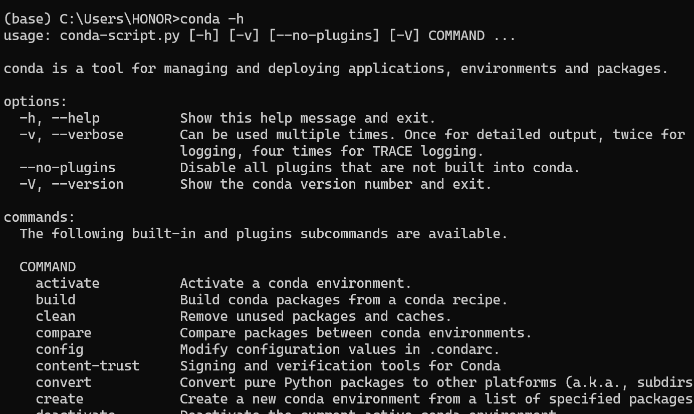

### 虚拟环境配置

一般是一个项目一个虚拟环境，主要是因为不同项目之间需要的依赖库不一样，比如有些项目需要python3.9，有一些需要3.10，这两者之间就会存在冲突，这时候每个项目配置不同的虚拟环境就很有必要了

- 可以先通过以下命令查看当前有哪些环境：

  ```shell
  conda env list
  ```

  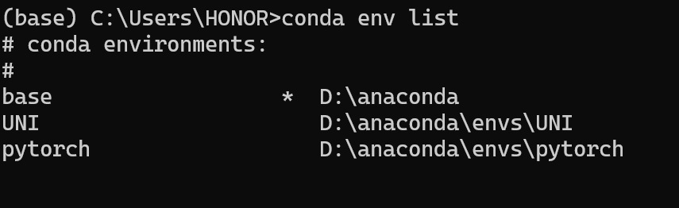

- 创建一个新的环境并在该环境中安装对应的依赖

  ```
  conda create --name myenv(your env name) python=3.8(your python version)
  ```

  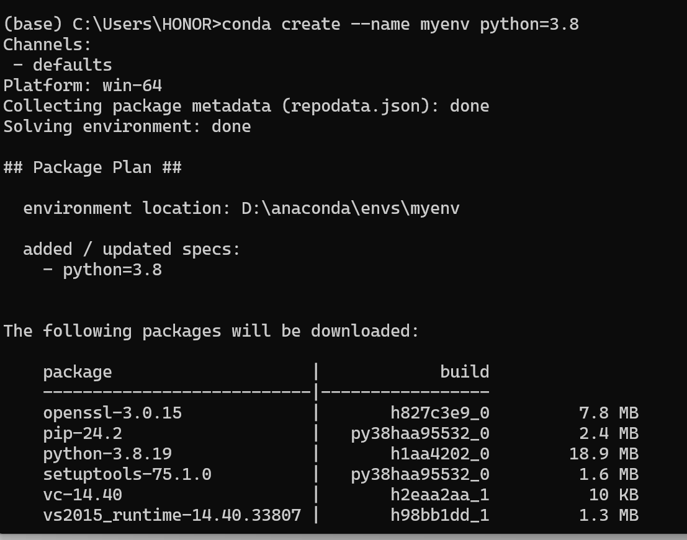

- 激活环境

  ```
  conda activate myenv
  ```

  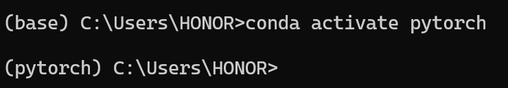

- 删除环境

  ```
  conda env remove -n myenv
  ```

### 实际项目演示(pycharm)

我们从网上拉取我们想要的项目后，第一步往往是先在项目的File-->settings里面把python interpreter也就是解释器先设置好

- 假如你没有提前为项目创建好环境，建议先按照上面的步骤进行环境的配置
- 假如你已经为这个项目提前创建好了环境，那么你只需要在设置里面把python interpreter设置为该环境目录下的python.exe即可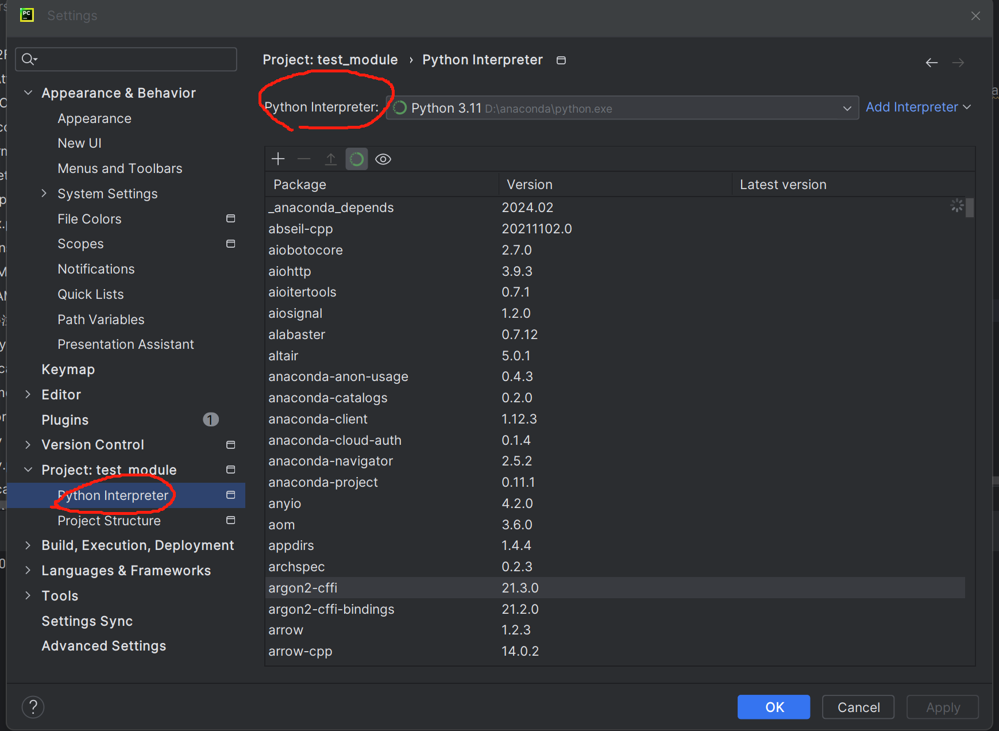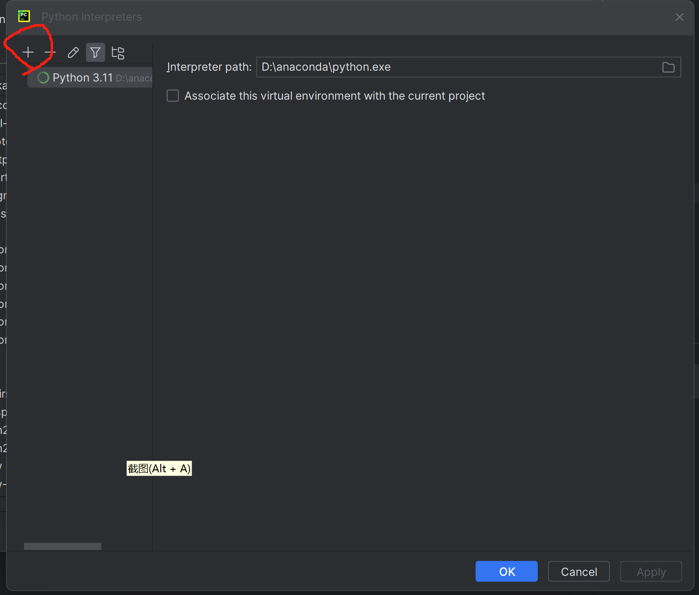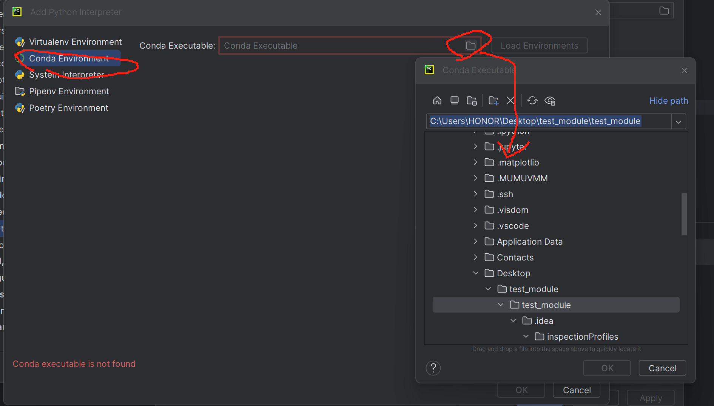
  - 环境的目录就在你anaconda安装目录下的envs文件夹里面，选取对应的环境名称文件夹里面的python.exe作为你项目的解释器即可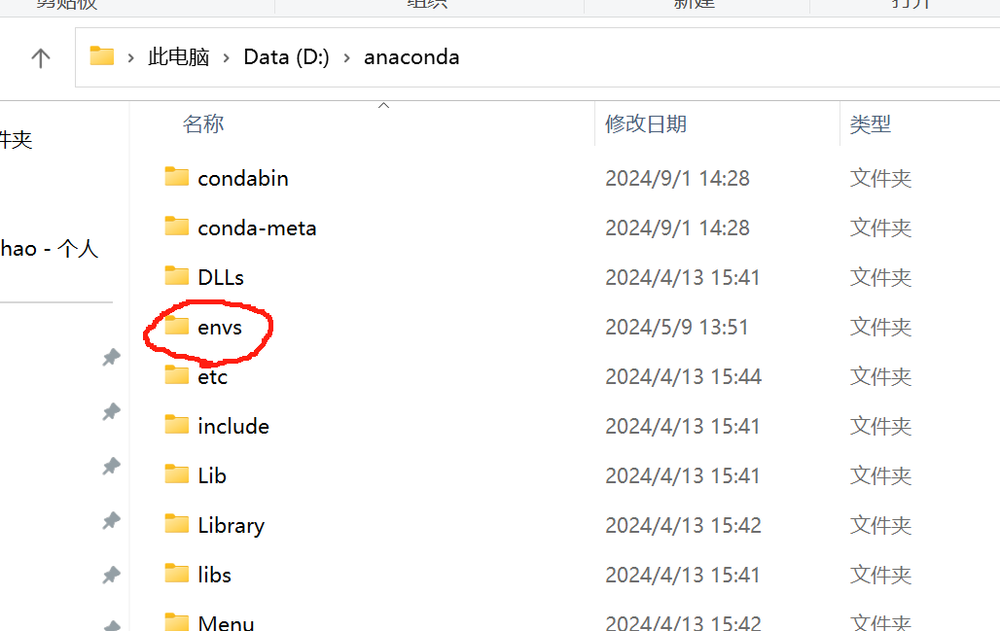


## 2、“GPT们”的前世今生（讲一下发展的脉络，主要讲nlp方向的发展，提及CV的发展即可）

### 人工智能、机器学习、深度学习（需要大数据支持）

**人工智能 (AI)**：让机器能够模仿人类的智能活动，由这个目的延伸出很多不同的方法
   |
   +--- **机器学习 (ML)**：

   |    |	专注于研究算法，让机器能够基于数据而非预先编写的程序进行预测

   |    |	**回归（线性、逻辑）**、**决策树**、**随机森林**、SVM（支持向量机）、朴素贝叶斯等
   |    |
   |    +--- **深度学习 (DL)**：机器学习的分支之一，但是目前已经成为主流方法，主要使用**多层神经网络（MLP）**来识别模式和特征
   |
   +--- 传统 AI 方法（如规则引擎、专家系统等）

### 语言模型发展脉络

#### **理论**：

1. **回归问题**
2. **神经网络**
   - 单层感知机
   - 多层感知机
3. **预训练模型**
   - 预训练语言模型
4. **Word2Vec模型**
   - 词向量的由来
5. **经典神经网络 模型**
   - 卷积神经网络(CNN)
   - ResNet
   - 循环神经网络 (RNN)
   - 长短期记忆网络 (LSTM)
6. **双向LSTM**
   - ELMO模型
7. **注意力机制**
   - "Attention Is All You Need"
8. **Transformer**
9. **Bert & GPT**

#### **实操**：

- 医学图像分割任务（UNet++模型）
- 多模态图文检索（Chinese-CLIP模型）
- 大模型本地部署、微调及量化（llama3模型）

## 3、pytorch基础（机器学习部分知识以及深度学习核心知识）

### 线性回归、损失函数与梯度下降算法

从一个简单的例子出发，房价预测

假如只得到了两组数据，那么二元一次方程就已经解决了y=wx+b

但是现实中往往会得到很多组观测数据，而且会有各种偏差y=wx+b+eps

这个时候我们往往不会追求完美的表达式，而是追求一个近似解，完成任务就可以了

这时候我们就想，怎么去优化这么一个表达式呢？我们不如先算一下误差吧，然后让误差尽可能小，这样就能得到一个比较好的近似解了

由此引出了非常经典的损失函数，均方差（MSE）
$$
loss = [y -(wx+b)]^2
$$

$$
\text{MSE} = \frac{1}{n} \sum_{i=1}^{n} (y_i - \hat{y}_i)^2\\
其中：\\
n是样本数量。这是一行文字，其中包含变量 y_i。\\
y_i  是第  i  个样本的实际值。\\
 \hat{y}_i 是第  i 个样本的预测值。
$$
然后我们根据已有的y和x数据，去求能让loss达到极小值（最小值）的一组w和b即可

如何去求得这么一组值，这个时候梯度下降算法就登场了

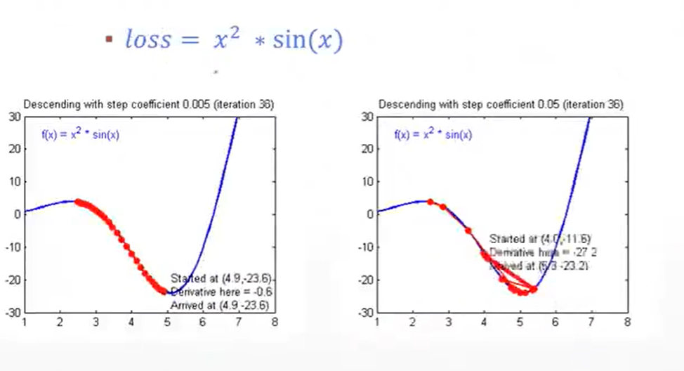

我们可以看下上面的例子，假设损失函数的表达式是上面那样，那么我们想要求上面的表达式的极小值怎么求？

有人可能说我求导，但是你会求导不代表计算机会求导，并且并不是所有的函数都能比较方便地去求导，所以这时候梯度下降算法的重要性就体现出来了。

其实梯度下降算法是17世纪一个法国数学家提出来的，所以大家不要觉得很多东西是从地里突然长出来的，其实都是站在巨人的肩膀上去解决问题
$$
loss = w^2*sin(w)\\
loss' = 2wsin(w)+w^2cosw\\
w^* = w-\frac{\partial loss}{\partial w}\\
$$
按照上面的公式进行反复循环更新，直到找到让loss函数达到极小值的w为止

如果是loss=f(w,b)，那么就是找到一组w，b为止

#### 学习率（learning rate）

$$
w^*=w-lr*\frac{\partial loss}{\partial w}
$$

通过学习率我们可以降低参数更新的幅度，让损失函数慢慢逼近我们的极小值，防止出现在极小值附近波动的情况

一般情况下学习率需要根据具体情况去规定，如果是比较简单的任务可以调成0.01也行，但是大多数情况都是1e-3


### 什么是张量（tensor）

刚刚讲了线性回归，里面的输入输出y和x大家可能往往会认为是一个个单一的数值，但是在现实世界里面，输入和输出往往比这个复杂很多，所以我们在这里引入了一个叫做张量的概念，其实也就是类似我们所说的向量和矩阵。现实当中一张图片、一个词、一句话都可以通过编码转换为向量，这里面编码的方式也是多种多样，比如针对词向量的就有one-hot编码、word2vec模型等，后面都会一一讲到。

张量（Tensor）是数学中的一种概念，它是对向量和矩阵的推广。在物理学和工程学中，张量用于表示多维数组，可以捕捉和表达多维空间中的信息。

在机器学习和深度学习中，张量的概念同样非常重要，它是一种用于表示数据的数据结构。以下是张量的一些基本特性：

1. **维度**：张量可以有任意数量的维度。一个标量（0阶张量）是一个单个数值；一个向量（1阶张量）是一维数组；一个矩阵（2阶张量）是二维数组；高于2阶的张量可以是三维或更多维的数组。

2. **形状**：张量的形状定义了每个维度上的大小。例如，一个形状为 (m, n) 的张量是一个矩阵，有 m 行和 n 列。

3. **数据类型**：张量可以包含各种类型的数据，如整数、浮点数、复数等。

4. **存储**：在计算机中，张量通常以连续的内存块形式存储。这使得张量可以高效地进行数学运算。

在深度学习框架中，如PyTorch，张量是构建模型的基本单元。它们用于表示网络的输入、输出、权重和偏置等。这些框架提供了丰富的操作来处理张量，包括算术运算、矩阵乘法、导数计算等。

例如，在PyTorch中，张量可以通过以下方式创建：

```python
import torch

# 创建一个5x3的矩阵（2阶张量）
x_data = torch.tensor([[1, 2, 3], [4, 5, 6], [7, 8, 9], [10, 11, 12], [13, 14, 15]])
```

张量在深度学习中的应用非常广泛，它们是实现神经网络和进行矩阵计算的基础。


## 4、单层、多层感知机

### 神经网络的由来

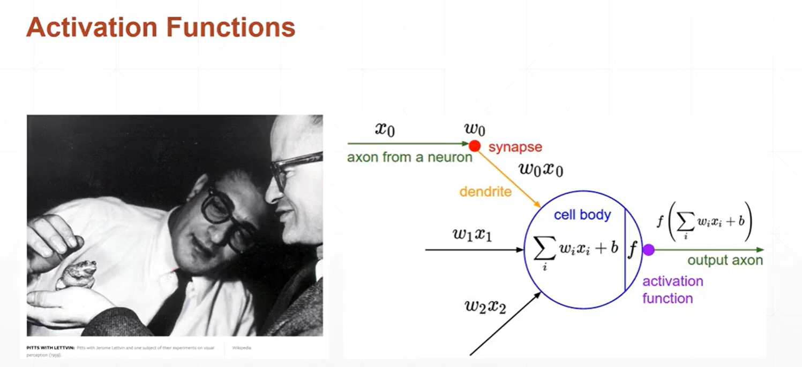

并不是简单的多个输入的加权求和，而是超过了某个阈值之后青蛙才会作出响应，生物学家称之为激活函数


### 单层感知机（单层神经网络）与激活函数

上面咱们讲到的线性回归其实存在一个很大的缺陷，就是我们现实当中很多映射并不是线性的，所以用线性回归就会很不准确，这个时候我们怎么解决这个问题呢？

接下来就是很关键的激活函数的提出

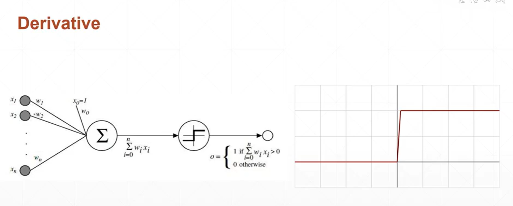

当时基于生物里面的激活函数，计算机科学家提出了一种叫做神经网络的概念来去模拟这种情况，也就是单层感知机的提出，这里假设激活函数是g，那么单层感知机的表达式如下：
$$
y_i=g(wx_i+b)
$$
但是这种最初的激活函数存在一个问题就是不可导，这样没法进行后续的参数更新，所以科学家顺势提出了一种新的激活函数，也就是我们现在非常常用的sigmoid函数

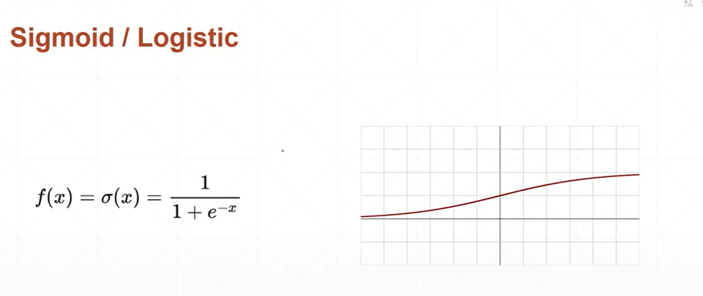

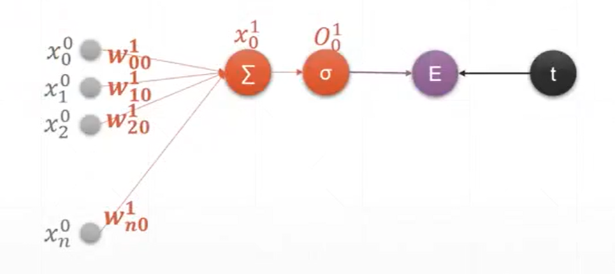

sigmoid函数的特点就是将线性函数转换成非线性函数（常用于逻辑回归与分类任务当中，后面会详细讲到），因为我们现实当中的很多映射其实根本就不是线性映射，所以用线性回归的方法去模拟这种分布其实是非常不准确的，激活函数就提供了一个由线性到非线性的转变过程，这让我们可以通过它去更好地模拟现实当中的非线性映射，这个在单层感知机的效果还不明显，但是到了多层感知机的时候模拟效果就好很多了

而且sigmoid函数会把函数的输出值压缩至0到1之间，我们要执行的很多比如分类任务、预测任务、生成任务等都需要一个概率的预测值，所以sigmoid函数就提供了很好的一个转换方式

sigmoid函数一般用于二分类的问题，softmax函数一般适用于多分类问题，当然还有很多别的激活函数，比如tanh、ReLU等，这些后面讲到的时候都会给大家细讲


### 多层感知机（多层神经网络MLP）

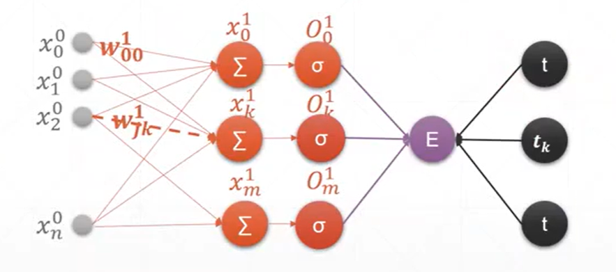

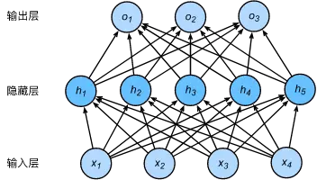

多层感知机（MLP）是单层感知机的扩展，由多个神经元层组成，包括：
1. 输入层：接收原始数据
2. 一个或多个隐藏层：处理来自前一层的信息
3. 输出层：产生最终结果

MLP的主要特点：
- 每层神经元与下一层的所有神经元全连接
- 使用非线性激活函数（如sigmoid、ReLU等）
- 能够学习更复杂的非线性关系
- 通过前向传播和反向传播进行训练

MLP是深度学习的基础，为更复杂的神经网络结构（如CNN、RNN等）奠定了基础。通过增加层数和使用不同的激活函数，MLP能够逐步学习数据中的复杂特征，从而完成各种复杂的任务。


### 前向推导（forward）和反向传播（backward）

从我们把输入传进神经网络里面进行运算，然后输出，再进行损失函数计算的一整个过程称之为一次前向传导


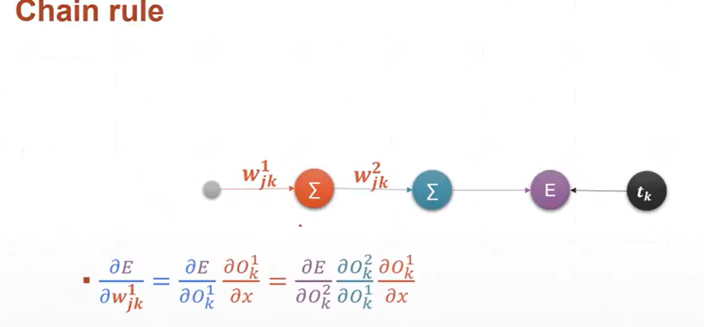

其实刚开始讲线性回归的时候，每进行一次w的更新，就是一次反向传播

这里用一个单层感知机来进行举例，我们想要求得损失函数E对于不同w的偏导，就需要用到链式法则，单层的还是比较简单的，多层就很复杂，但是实际上我们去运用的时候就一行代码

```python
loss.backward()
```

### 过拟合与欠拟合

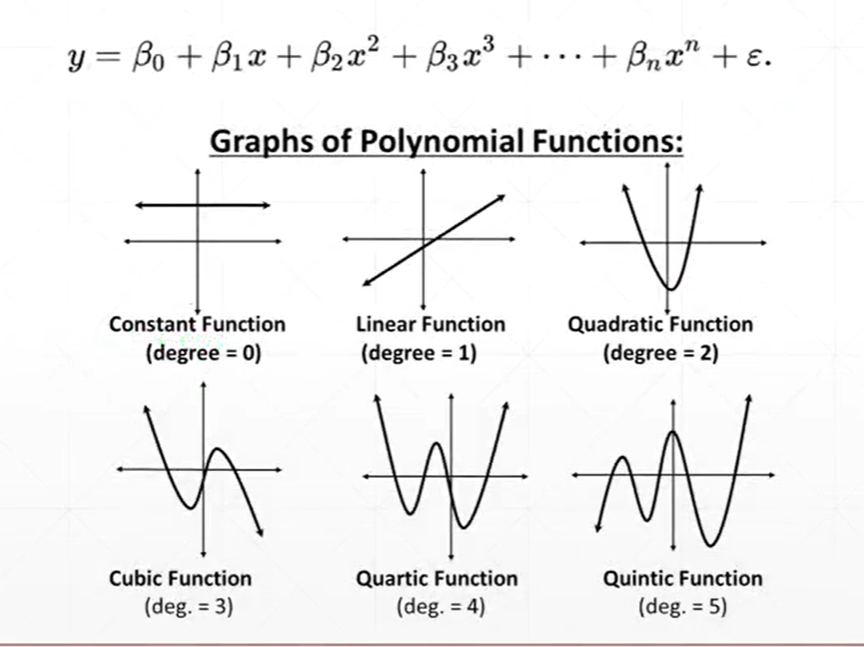

通过上面这幅图我们可以看到，随着表达式的次方逐渐增大，函数的抖动和表达的信息量都在增大

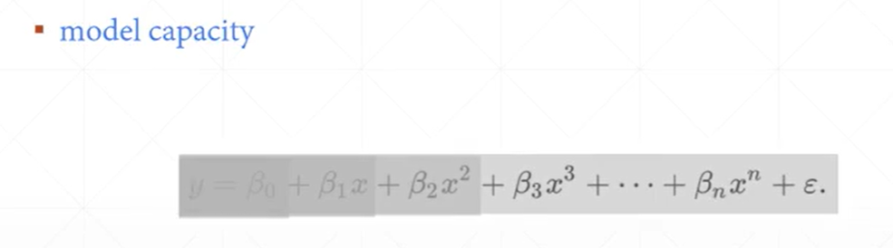

学习了单层感知机和多层感知机之后，其实大家对于神经网络的学习能力也有了一些初步的概念，单层感知机因为只有一层，所以学习到的信息其实是偏少的，表达能力也是比较差的，而模型复杂度上去之后，随着层数的增多，模型的表达能力会越来越强，也会学到越来越多的信息

欠拟合的概念就很简单，就是模型的复杂度不够，比如我的模型函数只有常数级，那么我就不可能表达出线性的函数关系，当然以现在的算力一般都不会欠拟合

但是模型并不是越复杂越好，因为随着表达能力的增强，模型可能会把我们收集到的错误的数据也学习进去（我们收集的数据因为是人为观测得到的，所以并不是完全客观的），所以这个时候就会导致过拟合现象的产生，也就是模型反而因为能力过强导致实际效果变差了

所以我们调整模型结构的一部分意义就在于不要让模型太过于复杂，只需要达到目标效果就可以了

### 逻辑回归与分类任务

逻辑回归这个概念其实比较尴尬，因为它现在已经完全被分类这个概念给替换掉了

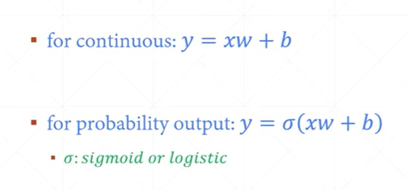

原本我们讲线性回归，然后加上sigmoid函数其实也就是我们所说的逻辑回归了，它这里其实是把线性回归当中的具体值转换成了概念，比如x=1时y=2，这是在线性回归里面的输入和输出，经过sigmoid函数后就会转换成对应的条件概率，也就是P(y=2|x=1)

所以说这其实也就是我们现在经常在做的一件事情——分类任务，比如我们输入一张猫的图片，然后进行猫、狗二分类任务（指认该图片是猫还是狗），这个时候就用sigmoid函数得到各自的概率就行，选取概率大的那个作为最终输出


# 补充

## 不同任务的损失函数

**回归任务**：

- **目标**：预测连续值，比如房价、温度等。

- **常用损失函数**：均方误差（Mean Squared Error, MSE）或均方根误差（Root Mean Squared Error, RMSE）。这些损失函数计算预测值与实际值之间的平方差，鼓励模型输出接近真实值的连续数值。

- **均方差（Mean Squared Error）**：
  均方差是回归任务中常用的损失函数，用于衡量预测值与实际值之间的差异。它的计算公式如下：
  $$
  \text{MSE} = \frac{1}{n} \sum_{i=1}^{n} (y_i - \hat{y}_i)^2\\
  其中：\\
  n是样本数量。这是一行文字，其中包含变量 y_i。\\
  y_i  是第  i  个样本的实际值。\\
   \hat{y}_i 是第  i 个样本的预测值。
  $$

**分类任务**：

- **目标**：预测离散的类别标签，比如垃圾邮件检测、图像识别等。

- **常用损失函数**：

  - **交叉熵损失**（Cross-Entropy Loss）：也称为对数损失，用于多分类问题。它衡量的是模型输出的概率分布与真实标签的概率分布之间的差异。

  - **二元交叉熵损失**（Binary Cross-Entropy Loss）：用于二分类问题，计算的是模型输出为正类的概率与实际标签之间的交叉熵。

  - **交叉熵损失（Cross-Entropy Loss）**：
    交叉熵损失是分类任务中常用的损失函数，用于衡量模型输出的概率分布与真实标签的概率分布之间的差异。对于多分类问题，交叉熵损失的计算公式如下：
    $$
    \text{Cross-Entropy Loss} = -\frac{1}{n} \sum_{i=1}^{n} \sum_{j=1}^{m} y_{ij} \log(\hat{y}_{ij}) \\
    
    其中：\\
    
     n 是样本数量。\\
     m 是类别数量。\\
     y_{ij}  是第 i  个样本的真实标签，如果第  j  个类别是正确的类别，则  y_{ij} = 1 ，否则  y_{ij} = 0 。\\
     \hat{y}_{ij}  是第  i  个样本预测为第  j  个类别的概率。
    $$
    对于二分类问题，交叉熵损失的计算公式可以简化为：
    $$
     \text{Binary Cross-Entropy Loss} = -\frac{1}{n} \sum_{i=1}^{n} [y_i \log(\hat{y}_i) + (1 - y_i) \log(1 - \hat{y}_i)] \\
    
    其中：\\
    
     y_i  是第 i  个样本的实际标签，通常取值为0或1。\\
     \hat{y}_i  是第  i  个样本的预测概率。
    $$

## 不同的激活函数

激活函数在神经网络中扮演着非常重要的角色，它们引入非线性因素，使得神经网络能够学习和模拟复杂的函数。不同的激活函数适用于不同的场景和需求。以下是一些常见的激活函数及其应用：

1. **Sigmoid**：

   - **定义**：
     $$
      \sigma(x) = \frac{1}{1 + e^{-x}} 
     $$

   - **用途**：早期的神经网络中常用于二分类问题，输出值在0和1之间，可以解释为概率。

   - **缺点**：梯度消失问题，当输入值很大或很小的时候，梯度接近0，导致网络训练困难。

2. **Tanh**（双曲正切函数）：

   - **定义**：
     $$
      \tanh(x) = \frac{2}{1 + e^{-2x}} - 1 
     $$

   - **用途**：输出值在-1和1之间，常用于隐藏层，因为它的输出值中心化在0。

   - **缺点**：同样存在梯度消失问题。

3. **ReLU**（Rectified Linear Unit）：

   - **定义**：
     $$
      f(x) = \max(0, x) 
     $$

   - **用途**：现代神经网络中最常用的激活函数，因为它简单且计算效率高，减少了梯度消失的问题。

   - **缺点**：存在“死亡ReLU”问题，即当输入小于0时，梯度为0，导致部分神经元不再更新。

4. **Leaky ReLU**：

   - **定义**：
     $$
      f(x) = \max(0.01x, x) 
     $$

   - **用途**：改进ReLU，为负输入提供一个小的非零斜率，以解决死亡ReLU问题。

5. **Parametric ReLU (PReLU)**：

   - **定义**：
     $$
      f(x) = \max(ax, x) 
     $$

   - **用途**：Leaky ReLU的变体，其中a是一个可学习的参数。

6. **ELU**（Exponential Linear Unit）：

   - **定义**：
     $$
      f(x) = \begin{cases} x & \text{if } x > 0 \\ \alpha(e^x - 1) & \text{if } x \leq 0 \end{cases} 
     $$

   - **用途**：类似于ReLU，但当输入小于0时，输出是负的，有助于提高模型的表达能力。

7. **SELU**（Scaled Exponential Linear Units）：

   - **定义**：
     $$
      f(x) = \lambda \left\{ \begin{array}{ll} x & \text{if } x > 0 \\ \alpha e^x - \alpha & \text{if } x \leq 0 \end{array} \right. 
     $$

   - **用途**：自带归一化效果，有助于网络训练的稳定性。

8. **Softmax**：

   - **定义**：
     $$
      \sigma(\mathbf{z})_i = \frac{e^{z_i}}{\sum_{j}e^{z_j}} 
     $$

   - **用途**：多分类问题的输出层，将输出转换为概率分布。


## 参考资料

1. b站龙曲良pytorch教程：[【完整版】龙良曲PyTorch入门到实战（附课程源码）全150讲，绝对通俗易懂！_AI人工智能/计算机视觉/深度学习/pytorch/神经网络_哔哩哔哩_bilibili](https://www.bilibili.com/video/BV12B4y1k7b5/?spm_id_from=333.337.search-card.all.click&vd_source=cc33baca3924010fdc3ce35af659c60a)
2. kimi AI：[Kimi.ai - 帮你看更大的世界 (moonshot.cn)](https://kimi.moonshot.cn/)

