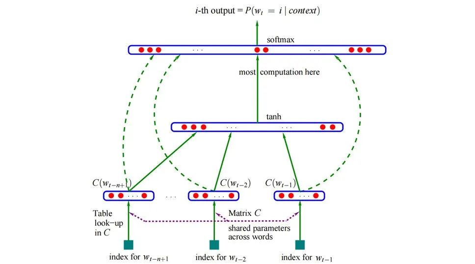
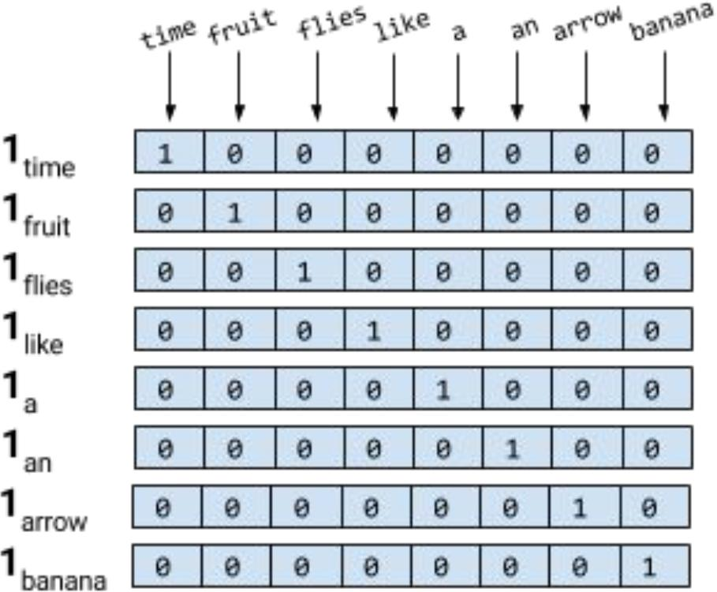
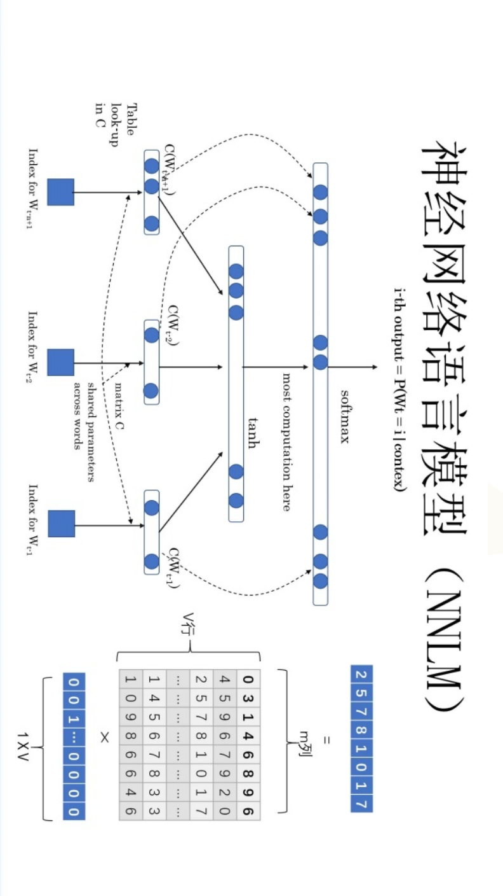
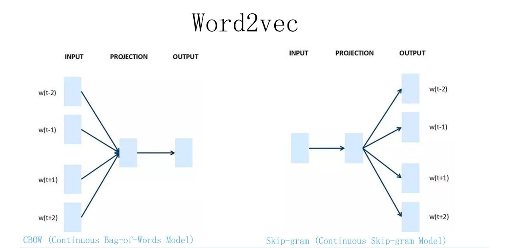
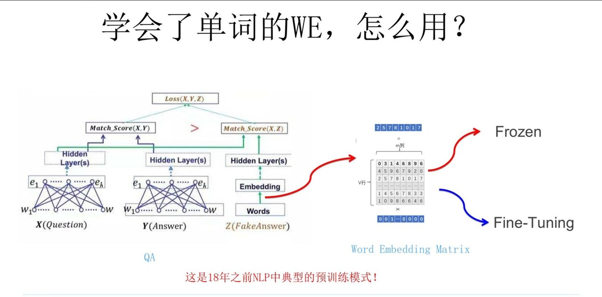

# 第三节 词向量模型与下游任务

## 一、神经网络语言模型（NNLM）

神经网络+语言模型--》**用神经网络的方法**去完成上面所说的两个和人说的话相关的任务。

咱们主要来看一下第二个任务：

"判断"，"一个"，"词"，"的"，"`___`"

假设词库里有"词性"和"磁性"，我们进行计算得到词库中每一个词的P(`__`|"判断"，"一个"，"词"，"的")

最终P(`词性`|"判断"，"一个"，"词"，"的")>P(`磁性`|"判断"，"一个"，"词"，"的")

选择概率最大的那一个作为最终输出



```
w1,w2,w3,w4（上述 4 个单词的独热编码，"判断"，"一个"，"词"，"的"）
Q就是一个随机参数矩阵，是一个参数（可学习）

w1*Q=c1,
w2*Q=c2,
w3*Q=c3,
w4*Q=c4,

C=[c1,c2,c3,c4]（把四个编码拼接成一个矩阵）
```

假设这个词典只有五个词："判断"，"这个"，"词"，"的"，"词性"
$$
softmax[tanh(WQ+b1)+b2]== [0.1, 0.1, 0.2, 0.2, 0.4] ∈[1,VL]
$$

### 独热编码（one-hot编码）

独热编码：让计算机认识单词



词典 V（新华字典里面把所有词集合成一个集合 V），假设词典里面只有 8 个单词

但是计算机不认识单词，比如想要计算机认识单词"fruit"，我们必须要先给这个单词进行编码（**word embedding**）

独热编码：给出一个 8*8 的矩阵

"time" --》 10000000

"fruit" --》 01000000

"banana" --》 00000001

#### 独热编码的缺陷

- **维度增加**：随着词的数量增加，编码矩阵的维度也在不断增大，这会导致运算以及存储等各方面的问题
- **稀疏矩阵**：可能会对某些算法造成负面影响（比如决策树等）
- **无法体现词与词之间的相似性**：
  - 当使用余弦相似度去计算两者的相似度的时候，你会发现全是**0**

## 二、词向量模型（word2vec）

### 词向量（神经网络语言模型的副产物）

给我任何一个词，

比如"判断" --》 独热编码w1 [1,0,0,0,0]

那么w1*Q =c1 （c1就是"判断"这个词的词向量）

词向量：就是用一个向量来表示一个单词

可以通过Q矩阵来控制词向量的维度（大小），即使w本来是1w维，但是只要Q足够小，就能让得到的词向量

如果我们得到的词向量，第一个问题也随之解决了（第一个和第二个任务就是不同的下游任务，这个概念会在后面详细讲解）

上节课咱们讲到了神经网络语言模型，它可以把独热编码进行又一次的运算，从而得到一组新的词向量，这一组词向量就不再是简单的one-hot（one-hot无法体现词与词之间的关系，而且随着词典中词数量的增多向量维度会越来越大），在**经过了神经网络之后的词向量可以表达出词之间的关系**，并且因为矩阵乘法的特点，**生成的新的词向量的维数可以被人为控制**，非常方便

（比如一个1000×1000的独热编码矩阵，最终与1000×20的矩阵相乘，那么我们就可以得到维数仅为20的新词向量）

这一个过程也可以称之为**词嵌入（word embedding）**

NNLM（神经网络语言模型） 和 Word2Vec 基本一致（可以说是一模一样），不考虑细节，网络架构就是一模一样，所以说词向量是NNLM的副产物

大家可以对比一下下面的两张图（特意翻转了一下NNLM的图），不能说非常相似，只能说一模一样





### 词向量模型

词向量模型大致可以分为下面两种类型：

#### CBOW（通常用这个思路会更多，也更符合人类的思维习惯）

给出一个词的上下文，预测这个词

"我是最`____`的Nick"，相当于做一个完形填空，预测中间空着的这个词是什么

"帅" 、"丑"....

#### Skip-gram

给出一个词，预测这个词的上下文

"帅"

"我是`_`的Nick"

### NNLM 和 Word2Vec 的区别

**NNLM --》** 重点是预测下一词，双层感知机，最终要求预测的准确率要高，所以必须使用激活函数以及残差等等操作来提高模型的复杂度，让输出的结果更加准确
$$
softmax(W_2[tanh(W_1(xQ)+b1)]+b2)
$$
**Word2Vec --》** CBOW 和 Skip-gram 的两种架构的重点都是为了得到一个更好的 Q 矩阵，从而利用这个Q矩阵去获得更好的词向量，也就是说相比NNLM，预测的结果是什么对它而言并不是很重要，所以它这里并没有使用激活函数（激活函数的使用就是为了让模型的输出更准确，这里我们并不是很关注输出结果的准确性，所以并没有使用，还可以减少复杂度）
$$
softmax(W_2[W_1(xQ)+b1]+b2)
$$


1. **CBOW**：一个老师告诉多个学生，Q 矩阵怎么变
2. **Skip-gram**：多个老师告诉一个学生，Q 矩阵怎么变

### Word2Vec的缺点

- **一词多义问题**


​	apple [0 0 0 1 0] , apple × Q = [10，12，19]

​	apple（苹果，苹果手机）

​	假设数据集里面的 apple 只有苹果这个意思，没有苹果手机这个意思，我们在得到了这个词向量之后要拿去做下游任务，也就是要应用它

​	但是在应用或者测试阶段，apple有可能会表示苹果手机而不是苹果，而apple:[10，12，19], 这个词向量无法表示苹果手机这个意思

​	**词向量不能表达一词多义的情况 ---》 ELMO要解决的事情**

## 三、预训练语言模型的下游任务

### Word2Vec --》 是一个神经网络语言模型，其次它的主要任务是做（生成词向量，Q矩阵）

Word2Vec 模型是不是预训练模型？（一定是）

什么是预训练？

给出两个任务 A 和 B，任务 A 已经做出了模型 A，任务 B 无法解决（通过使用模型 A，加快任务的解决）

给你一个 NLP 里面的任务，给一个问题 X（Question），给出一个回答 Y（Answer）



预训练语言模型终于出来（给出一句话，我们先使用独热编码（一一对应的一种表查询，不是预训练），再使用Word2Vec 预训练好的 Q 矩阵直接得到词向量，然后进行接下来的任务）

1. 冻结：可以不改变 Q 矩阵
2. 微调：随着任务的改变，改变 Q 矩阵

### 下游任务

得到词向量之后可以用来做各种不同的任务，也就是前面word embedding部分的预训练语言模型一般是固定的，但是后面得到词向量之后的具体任务是可以随便更改的

比如：

1. **文本分类**：使用词向量作为特征输入，可以对文本数据进行分类，如情感分析、主题分类等。
2. **机器翻译**：词向量可以帮助模型捕捉源语言和目标语言之间的语义对应关系，提高翻译质量。
3. **信息检索**：通过计算查询关键词和文档的词向量相似度，可以实现更精确的搜索结果。
4. **语义相似性计算**：通过计算两个词向量的余弦相似度等指标，可以评估两个单词在语义上的相似程度。
5. **命名实体识别 (NER)**：词向量可以帮助模型理解上下文，从而准确识别和分类文本中的实体（如人名、地名）。
6. **问题解答**：词向量通过加强对问题提出和答案查找的语境的理解，来帮助问题解答系统取得成功。
7. **文本生成**：在语言建模和自动编码器等文本生成任务中，词嵌入通常用于表示输入文本，并生成连贯且上下文相关的输出序列。
10. **推荐系统**：在推荐系统中，词向量可以用于表示物品和用户兴趣的向量表示，通过计算向量间的相似度来推荐相似的物品或服务。
