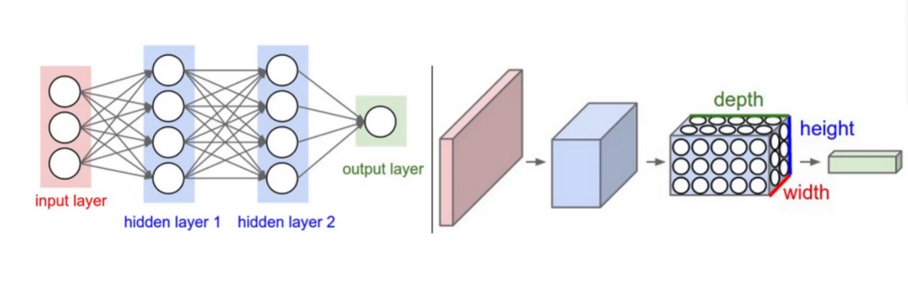
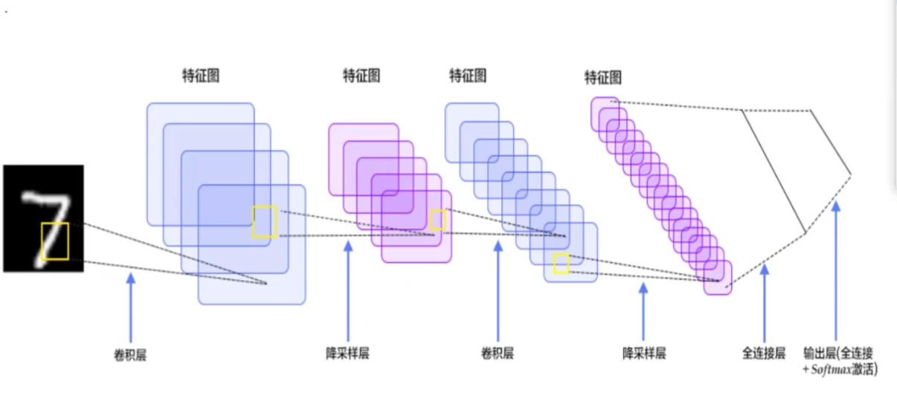
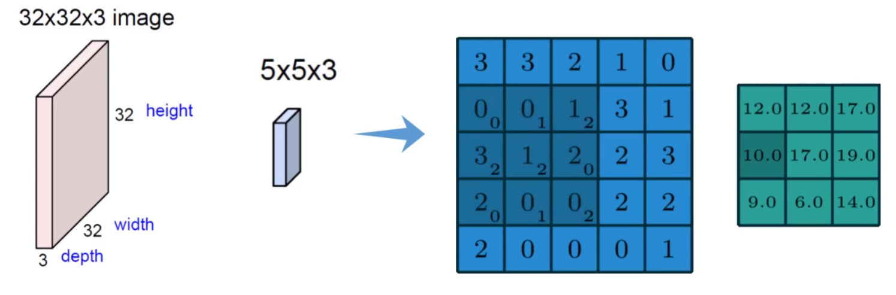
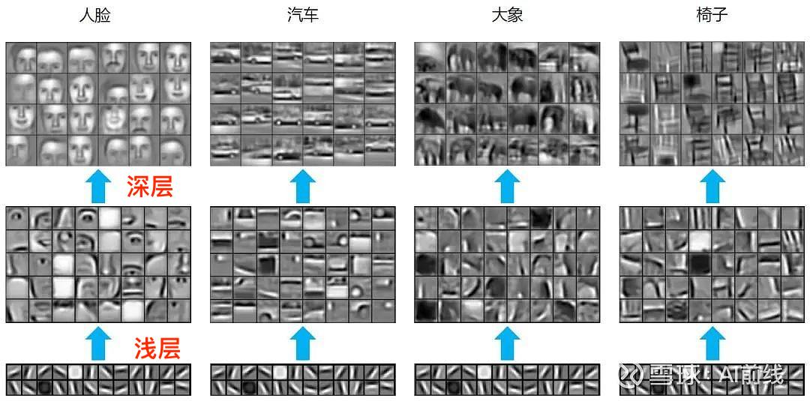
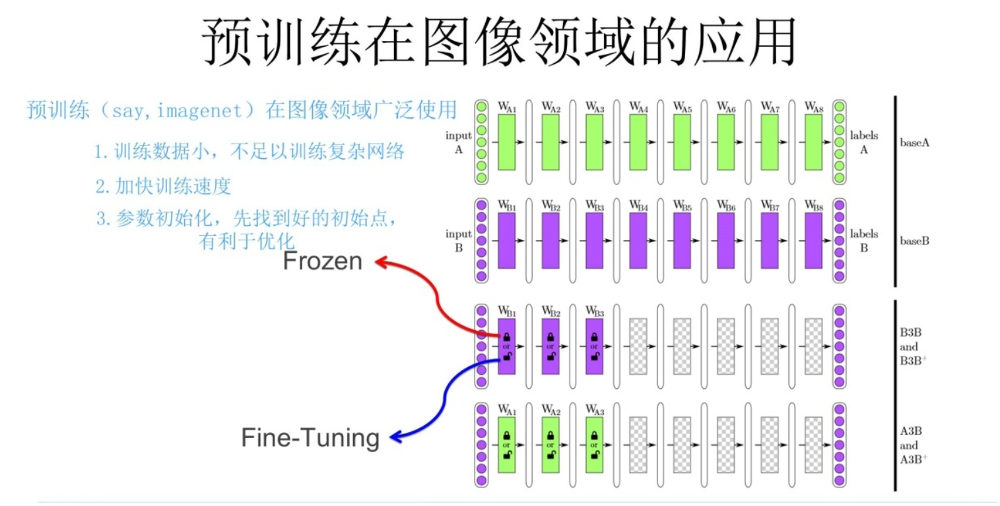

# 第二节 预训练、语言模型及huggingface实操

## 一、为什么需要预训练

预训练这个概念最早是在CV领域提出的，后面广泛应用到所有的AI领域

深度学习（人工智能）的项目：需要大数据支持（主流）

然而我们很多项目并没有大数据支持（只有一些小数据），由此引出了预训练的概念

在讲解什么是预训练之前，我们需要把CNN给讲明白

### 补充：什么是卷积（CNN，第四节有详细讲解，这里简单提一嘴）



之前跟大家讲到的MLP里面的输入都是一个一个的tensor张量，但是我们外界的输入一开始不可能是这么一个向量对吧。

比如在CV领域，外界的原始输入其实是一张张图像或者视频，在nlp领域，输入一开始可能是各种文本数据，怎么把这些数据转换成我们所说的tensor呢？这个操作就叫做embedding，也就是嵌入或者理解为编码也行

CNN就是在图像领域的专门做embedding的一个网络，经过卷积之后我们就能够获得图像对应的特征也就是tensor了。

**下面就是一个CNN模型的框架图**



#### 怎么实现卷积



图像其实就是由一个个像素点组成，大家可以看到那个蓝色的大矩阵，里面就是由一个个像素点组成，每个点的值不一样，最终呈现出来的图像就不一样。

我们想一下，比如有一张猫的图片，它的眼睛、鼻子和嘴巴的特征能是一样的吗，是不是不同的部位特征是不一样的啊。所以卷积其实就是在把图片里面不同部位的特征给提取出来，那么它是怎么实现的呢？

可以看到上面的图，里面用了一个比较小的矩阵，用这个比较小的矩阵对原来的图像矩阵做一个扫描（不同于矩阵乘法，这里是矩阵对应位置的值直接相乘，有点类似做内积），这个比较小的矩阵我们一般称之为**卷积核（kernel）**。经过这一轮操作之后，我们可以得到一个新的矩阵（大小一般是小于或等于原来的图像矩阵），这个矩阵上面都是我们提取出来的特征值，所以称之为特征图。

这里面卷积核的大小、池化、步长以及填充等概念在第四节会进行详细讲解。大家可以初步理解为，比如我只想比较粗粒度地提取的时候就用大卷积核和大步长，想细粒度提取的时候就用小卷积核和小步长（比如我只想提取鼻孔的特征就用大卷积核，但是我想进一步提取鼻毛的特征就得用更小的卷积核）。

卷积可视化网站：[CNN Explainer (poloclub.github.io)](https://poloclub.github.io/cnn-explainer/)

## 二、什么是预训练

假如给你一个猫狗分类任务，但是只有100 张猫和狗的图片，然后让你训练出一个深度学习模型，能够实现：给你一张图片，分出是猫还是狗，很显然这在早期是无法实现的，或者说就算利用100张图片训练出来一个模型，精度也非常低，无法实际应用

但是后来我发现有别人做好的模型，他们用了100000 张鹅和鸭的图片训练出来一个模型A，这时候我们就想，能不能用这个现成的别人训练好的模型来做我们的任务



有人发现，虽然上面的层很多特征还是不一样的，但是底下的浅层的特征是通用的（横竖撇捺）

也就是说别人通过10w个鹅和鸭训练了一个模型 A（假设是100 层的 CNN），虽然我自己不可能通过100 张猫和狗的图片训练出100层的 CNN模型，但是我可以尝试使用 A 的浅层通用的参数去完成任务 B



而这里面又有两种做法：

1. 冻结：浅层参数不变
2. 微调：浅层参数会跟着任务 B 训练而改变

### 总结

什么是预训练：

**通过一个已经训练好的模型 A，去完成一个小数据量的任务 B（使用了模型 A 的浅层参数）**

**前提：任务 A 和任务 B 极其相似**

## 三、怎么使用预训练模型（huggingface预训练模型实操）

fairseq 、transformers 库，里面包含大量的预训练模型及其源码，可以非常方便地使用别人的预训练模型（直接用或者微调）

huggingface网站链接：[Hugging Face – The AI community building the future.](https://huggingface.co/)

**实操示例链接**：[1.课程简介_哔哩哔哩_bilibili](https://www.bilibili.com/video/BV1a44y1H7Jc/?p=1&vd_source=cc33baca3924010fdc3ce35af659c60a)

**简单示例（jupyter notebook）**

### 流程简介

1. 在anaconda里面安装好transformers库（包含了huggingface上面所有的预训练模型），以及datasets库（加载数据集）       pytorch下载链接：https://pytorch.org/

   ```python
   pip install transformers
   pip install datasets
   #在安装pytorch的时候，要注意自己的系统是Windows、Linux还是macos，以及自己有没有独立显卡，有的话要下载cuda版本，没有就下载cpu版本，官网上面会给出pip以及conda安装对应版本的命令，复制粘贴即可
   pip install torch
   ```

2. 加载数据集（选择huggingface里面的数据集或者任何自己下载的数据集都行）

3. 调用huggingface预训练模型，把数据集加载到模型中进行推理

4. 得到输出，根据自己具体要做的任务对得到的输出进行处理即可

## 四、统计语言模型

### 什么是语言模型

语言（人说的话）+模型（接收输入，经过处理之后得到输出）

### 语言模型的两个典型任务

1. 判断下面两个概率谁大

   P("判断这个词的词性")，P("判断这个词的磁性")

2. 预测下一个词是什么

   "判断这个词的`______`"

### 统计语言模型

用统计的方法去解决上述两个问题

### 问题一

首先对于这句话我们要先**分词**，也就是把这个句子分成一个个词语，"判断这个词的词性" = "判断"，"这个"，"词"，"的"，"词性"

并且这句话是个序列（词语之间是有先后顺序的）

我们想要判断整个句子按照这个顺序组合在一起的概率，需要用**条件概率的链式法则**（概率论）进行计算

$$
P(w_1,w_2,...,w_n) = P(w_1)P(w_2|w_1)...P(w_n|w_1,w_2,...,w_{n-1})
$$
通过这个法则，我们可以求出每一个词出现的概率，然后连乘，就是这句话出现的概率

### 问题二

"判断这个词的`__`"

$$
P(w_next | "判断"，"这个"，"词"，"的") .....(1)
$$
w_next就是词库（词典，可以当成新华字典）V当中的词语，也就是把所有词装到集合 V 里

把集合里的每一个词，都进行像（1）一样的计算

假设词库 V = { "词性"， "火星"}（实际上这个词库是很大的，包含了几乎所有的词语以及大量分词后的句子）

P(词性| "判断"，"这个"，"词"，"的")

P(火星| "判断"，"这个"，"词"，"的")

$$
P(w_{next}|判断,这个,词,的)=\frac{count(判断,这个,词,的,w_{next})}{count(判断,这个,词,的)}
$$


### n元统计语言模型

上面的例子里面句子还比较短，假如句子很长，那么分出来的词就会很多，这个使用即使使用链式法则，运算量也会特别大

n元统计语言模型，就是**只考虑w_next前面的n个词**，其他的词就不做考虑

比如**三元语言模型**就是只考虑w_next前面3个：
$$
P(词性|"这个","词","的")\\

P(火星| "这个","词","的")
$$


二元语言模型：
$$
P(词性|"词","的")\\

P(火星|"词","的")
$$
一元语言模型：
$$
P(词性|"的")\\
P(火星|"的")
$$
把 n 个词，取 2 个词（2 元），取 3 个词（3 元）

#### 如何去计算

```basic
"词性是动词"
"判断单词的词性"
"磁性很强的磁铁"
"北京的词性是名词"
```

$$
𝑃(词性|的) = \frac{count(词性，的)}{count(的)} = \frac{2}{3}
$$


## 平滑策略

假如词库是V = { "词性"， "火星"}，那么"策略"和"平滑"在词典中出现频率为0（当然，这样的话"平滑"和"策略"同时出现的频率也肯定为0），这样就会出现分母为0的情况
$$
P(策略|平滑) = \frac{0}{0}
$$
为了避免出现这种情况，就出现了平滑策略
$$
P(策略|平滑) = \frac{count("平滑","策略")+1}{count("平滑")+|V|}
$$
当然这只是最简单的平滑策略，还有很多更复杂的比如拉普拉斯平滑策略等等，这些大家有兴趣可以自行学习一下

## 统计语言模型的缺陷（这些问题都是后续要一一解决的问题）

1. **数据稀疏性**：随着模型阶数的增加，需要估计的概率数量呈指数级增长，导致数据稀疏问题，即许多n-gram组合在训练语料中从未出现，这使得模型难以处理未出现过的词序列。

2. **长距离依赖问题**：统计语言模型，如n-gram模型，主要依赖于相邻的词来预测下一个词，这限制了它们捕捉文本中长距离依赖关系的能力。

3. **缺乏语义理解**：统计语言模型主要基于词频和序列出现的概率，而不是词的意义和上下文，这限制了它们对语言的深层理解能力。

4. **维数灾难**：随着模型阶数的增加，模型的参数空间呈指数增长，这不仅增加了计算的复杂性，也加剧了数据稀疏问题。

5. **偏见和歧视**：统计语言模型可能会从训练数据中学习并复制偏见，如性别、种族和文化偏见，这可能导致生成的文本反映出这些问题。

6. **过度拟合**：大型统计语言模型可能会过度拟合训练数据，导致在未见过的数据上性能下降。

7. **计算资源需求**：训练和运行大型统计语言模型需要大量的计算资源，这可能限制了它们在资源有限的环境中的应用。

8. **模型泛化能力**：统计语言模型在跨语料种类时可能表现的性能差异问题，难以保持一致的描述能力。

9. **平滑和回退策略的局限性**：尽管平滑方法可以缓解数据稀疏问题，但这无法完全解决统计语言模型在长距离依赖中的不足。
