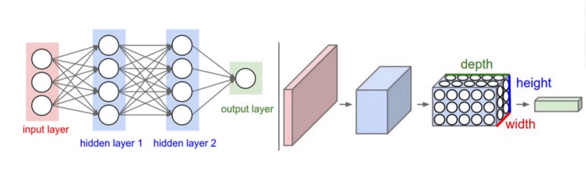

# 第四节 三大经典模型讲解

## 1、CNN（卷积神经网络）

### CNN的应用

- CV
- 图学习
- 文本任务

迪哥视频链接：[超全超简单！一口气刷完CNN、RNN、GAN、GNN、DQN、Transformer、LSTM、DBN等八大深度学习神经网络算法！真的比刷剧还爽！_哔哩哔哩_bilibili](https://www.bilibili.com/video/BV1XVs6eXEiC/?spm_id_from=333.337.search-card.all.click&vd_source=cc33baca3924010fdc3ce35af659c60a)

### 什么是卷积（卷积的定义和运算过程）

之前跟大家讲到的MLP里面的输入都是一个一个的tensor张量，但是我们外界的输入一开始不可能是这么一个向量对吧。

比如在CV领域，外界的原始输入其实是一张张图像或者视频，在nlp领域，输入一开始可能是各种文本数据，怎么把这些数据转换成我们所说的tensor呢？这个操作就叫做embedding，也就是嵌入或者理解为编码也行

CNN就是在图像领域的专门做embedding的一个网络，经过卷积之后我们就能够获得图像的一个特征

#### 卷积的运算过程

**下面就是一个CNN模型的框架图**

图像其实就是由一个个像素点组成，大家可以看到那个蓝色的大矩阵，里面就是由一个个像素点组成，每个点的值不一样，最终呈现出来的图像就不一样。

我们想一下，比如有一张猫的图片，它的眼睛、鼻子和嘴巴的特征能是一样的吗，是不是不同的部位特征是不一样的啊。所以卷积其实就是在把图片里面不同部位的特征给提取出来，那么它是怎么实现的呢？

可以看到上面的图，里面用了一个比较小的矩阵，用这个比较小的矩阵对原来的图像矩阵做一个扫描（不同于矩阵乘法，这里是矩阵对应位置的值直接相乘，有点类似做内积），这个比较小的矩阵我们一般称之为**卷积核（kernel）**。经过这一轮操作之后，我们可以得到一个新的矩阵（大小一般是小于或等于原来的图像矩阵），这个矩阵上面都是我们提取出来的特征值，所以称之为特征图。

并且，卷积核的个数并不是只有一个，可以有很多个，也就是说我们通过设置不同的卷积核可以以不同的方式和粒度去得到多个特征图，也就是可以多尺度地进行特征提取，这样得到的特征会更丰富。（但是一个卷积层里面的卷积核大小必须一样）

**总而言之，卷积层的作用就是尽可能多、尽可能丰富地去提取图像上面的特征**

#### 池化层的作用

我们在卷积层得到了很多的特征，这些特征并不是全都很重要，而且如果全部保留这些特征的话计算复杂度会很高

所以我们加入了一个池化层（pooling，或者称为降采样层），去压缩一下之前得到的一个特征图（feature map），减少一些无用信息，把最重要的信息保留下来。这样可以降低计算复杂度和存储开销。

这里面有两种方法，一种叫做最大池化，可以参考上面的图，就是选取一个区域里面最大的特征值保留下来，其他全部舍弃；另一种叫做平均池化，就是把一个区域内的特征值求平均然后保留下来，一般来说用最大池化比较多，因为这样可以保留最重要的特征

### 卷积的四个重要参数

#### 卷积核大小

大家可以初步理解为，比如我只想比较粗粒度地提取的时候就用大卷积核和大步长，想细粒度提取的时候就用小卷积核和小步长（比如我只想提取鼻孔的特征就用大卷积核，但是我想进一步提取鼻毛的特征就得用更小的卷积核）。

卷积核具体的大小一般要根据任务去进行不同的定义。

#### 卷积核个数

卷积核的个数并不是只有一个，可以有很多个，也就是说我们通过设置不同的卷积核可以以不同的方式和粒度去得到多个特征图，也就是可以多尺度地进行特征提取，这样得到的特征会更丰富。（但是一个卷积层里面的卷积核大小必须一样）

#### 滑动窗口步长step

简单来说就是卷积核每次移动的间距，比如每次只移动一格，那么步长就为1，这里面步长大小的设定也是根据具体任务来。

#### 边缘填充padding

假如我们只在原图上做卷积，那么得到的特征图一定比原来的图像小，假如我想让特征图矩阵的size跟原来一样，从而能保留更多的一个特征，那么这时候我们可以在图像的边缘给它加一层填充，这些填充的格子里面全是0，这样我们就有机会得到跟原来图像一样size的特征图了。

可以参考上面图里面的padding层（补零填充）

### 卷积神经网络架构

### 经典CNN模型

#### AlexNet

#### VGG

人们以为卷积层越多，神经网络越深，最终效果越好，但是事实并非如此，这就引出了下面的ResNet

## 2、ResNet（残差网络）

为了解决层数变多之后效果反而变差的问题，就有人（何凯明）提出了残差网络的思想

这个思想的核心出发点就是，通过残差网络的方式，起码不会让模型的效果比原来更差，就是有了个保底

那他是怎么实现的呢？其实很简单，就是相当于我给每一个层都加了一个旁路，比如说从A->B->C，假如B学得好，我就保留这一层，假如B的效果很差，那么我就不要B了，而是从旁路出发，直接把A的结果输入到C，这里称之为同等映射
$$
H(x)=F(x)+x
$$

## 3、RNN（递归神经网络）

### RNN

[新手狂喜！一小时带你搞懂【LSTM情感分析】，架构解读+案例实战+数据集处理，深度学习NLP核心知识点竟然被他讲得如此透彻！！！_哔哩哔哩_bilibili](https://www.bilibili.com/video/BV1HS2uYWE4X/?spm_id_from=333.337.search-card.all.click&vd_source=cc33baca3924010fdc3ce35af659c60a)

大家可以回想一下之前我们讲的MLP，里面的每个输入其实都相对独立的，起码在时间层面上来说是没有先后关系可言的。像CNN就是这样，所以它在处理单张图片的时候其实是没啥问题的，但是为什么不用CNN去处理自然语言呢？因为我们人说的话是有时间上的先后顺序的，也就是所谓的**时序相关**。而CNN里面的各个输入（图片的不同区域）其实在时间上来说是没有这种关联性的。

因此我们必须要换一种方式来更好地处理这种时序相关的数据，也就是RNN。我们可以看到上图的右边，这就是一个RNN结构，它整体上而言跟MLP是很像的，但是大家可以看到中间部分多了一个循环的箭头，这里其实就是RNN处理时序数据的核心要素。

0我们可以看到这张更加详细的RNN结构图，我们在输入数据的时候是从x_0到x_t的，按照先后顺序进行输入，并且在中间的隐藏层部分（也就是A那里），我们可以看到后面的A不仅可以接收到该层的输入还可以接收到前面的输入的处理结果（比如第二个A的输入不仅有x_1还有前面x_0的处理结果)，因此这里面就保留了这个时间上的序列关系，中间产生的这些结果h_i都不是很重要，我们重点关注最终的输出h_t，这里的h_t保留了所有x的特征，而且还保留了它们的先后顺序的信息，所以RNN用来处理自然语言这种时序数据是比较合适的。

### RNN的缺陷

但是RNN的缺陷也比较明显，就是容易产生**梯度爆炸和梯度弥散**的问题，并且也没有解决词向量不能表示一词多义的问题，所以后面的LSTM和ELMO都是对RNN的持续改进（虽然也是治标不治本）

所谓的梯度爆炸或者梯度弥散就是这样：假如中间的A都是线性层（当然包含非线性层，但是影响不大），那么最终的输出是这样的
$$
h_t = w_t(w_{t-1}(...(w1x_0+b_1))+b_{t-1})+b_t
$$
这里面是不是有很多的W矩阵进行累乘的操作啊？所以假如这些矩阵的值有很多都比较小或者比较大的时候，累乘起来就会导致最终的梯度很小或者很大的情况，这个时候就会导致最终结果要么几乎为0，或者大到不敢想象（在模型训练时的体现就是要么模型更新得很慢，要么模型就容易数值溢出，最终都是loss无法收敛）

还有因为RNN因为必须按照顺序输入，所以**无法并行**，因此效率很低

